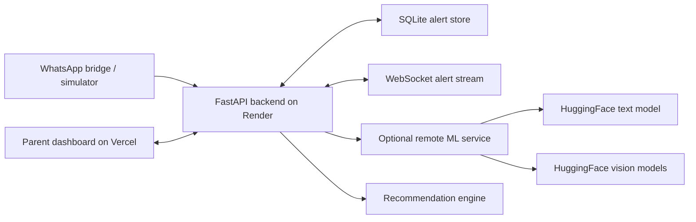

<div align="center">


# ParAlert

### מערכת התראות בזמן-אמת על פגיעה בילדים ברשת

**Real-time child-safety alerting for parents.**
ParAlert monitors chat messages and media, detects harmful dynamics around children, and gives parents the context and calm guidance they need — *before* reacting out of panic.

<br/>

[](https://hackathon-project-tau-seven.vercel.app)
[](https://safenet-backend-cnmy.onrender.com)
[](https://safenet-backend-cnmy.onrender.com/docs)
[](#-tech-stack)
[](#-tech-stack)

<br/>

**[🖥️ Parent Dashboard](https://hackathon-project-tau-seven.vercel.app)** ·
**[💬 Try-it Chat](https://hackathon-project-tau-seven.vercel.app/?lang=en&tab=chat)** ·
**[📖 API Docs](https://safenet-backend-cnmy.onrender.com/docs)**

</div>

---

## Contents

- [The Problem](#-the-problem)
- [Our Solution](#-our-solution)
- [Core Capabilities](#-core-capabilities)
- [Architecture](#-architecture)
- [Tech Stack](#-tech-stack)
- [API Reference](#-api-reference)
- [Local Development](#-local-development)
- [Environment Variables](#-environment-variables)
- [Repository Map](#-repository-map)
- [Product Vision](#-product-vision-whatsapp-kids)
- [Important Notes](#-important-notes)

---

## 🎯 The Problem

הורים כיום כמעט עיוורים למה שמתרחש בקבוצות הוואטסאפ של הילדים שלהם. חרמות, איומים, הפצת תמונות אינטימיות, דיסאינפורמציה ו-Deepfakes יכולים להתרחש מתחת לרדאר.

כאשר הורה מגלה על אירוע רק בדיעבד, לרוב חסר לו הקונטקסט המלא: מי התחיל, מה נאמר לפני, האם הילד שלו היה קורבן, תוקף או צופה מהצד, ומה הדרך הנכונה לדבר עם הילד בלי לשבור אמון.

> Parents are nearly blind to what happens inside their kids' group chats. By the time they hear about an incident, the full context — who started it, what was said, and what their child's role was — is already gone.

## 💡 Our Solution

ParAlert analyzes text, images, and videos in real time and sends meaningful alerts to a clean parent dashboard. Each alert includes:

- 📩 The risky message or media.
- 🚦 Severity level and category.
- 🎭 The child's role: **victim**, **aggressor**, **bystander**, **exposed**, or **none**.
- 🧵 Context before and after the message.
- 🤝 A practical, empathetic recommendation for how the parent should respond.
- 🚨 Escalation guidance for severe cases — sexual extortion, nudity distribution, real threats, or self-harm.

## ⚡ Core Capabilities

### Multi-Angle Detection

The system does more than classify content as good or bad. It tries to understand the **social dynamic**:

- Is the child being attacked?
- Is the child attacking someone else?
- Is the child watching a harmful event unfold?
- Is the child exposed to unsafe or manipulated media?

### Empathetic Parent Guidance

The recommendation engine turns a raw alert into a useful next step. Instead of leaving the parent with only a red warning, ParAlert explains how to approach the child calmly, what to ask, and when to involve school or authorities.

### Police Escalation

For extreme cases the backend can mark an alert for police-level escalation — used for categories such as sexual exploitation, nudity distribution, credible threats, and self-harm risk.

### Media Safety & Deepfake Signals

ParAlert accepts image and video URLs. The ML service downloads direct media files and analyzes them with HuggingFace vision models:

- NSFW / unsafe visual content detection.
- AI-generated image signal.
- Experimental video deepfake signal.

> **Note:** the AI/deepfake score is treated as an *additional* signal, not the sole reason to flag content. The **safety score** is the main trigger for harmful visual content.

### Try It Yourself

The dashboard includes an interactive **bilingual (he/en) chat experience** for testing the models with text and media — useful for demos, judges, and developers who want to see how the system reacts to different scenarios.

## 🏗️ Architecture



ParAlert uses a **hybrid, demo-resilient** architecture:

- The frontend runs on **Vercel**.
- The API runs on **Render** with FastAPI.
- Alerts stream live through **WebSockets** (dashboards may still poll `GET /alerts`).
- Demo data comes from the **simulator** or the **WhatsApp bridge** — both emit the same message contract, so the backend is source-agnostic.
- Heavy ML inference can run on a stronger local machine and be exposed through a secure tunnel.
- If the remote ML service is unavailable, the backend keeps the demo alive with **lightweight fallback logic**.

## 🧰 Tech Stack

| Layer | Technology |
| --- | --- |
| Frontend | React 19, Vite 6, Tailwind CSS 4, Vercel |
| Backend | FastAPI, SQLite, WebSockets, Render |
| Text ML | HuggingFace [`LikoKIko/OpenCensor-H1`](https://huggingface.co/LikoKIko/OpenCensor-H1) + Hebrew context heuristics |
| Media Safety | HuggingFace [`Falconsai/nsfw_image_detection`](https://huggingface.co/Falconsai/nsfw_image_detection) |
| Image AI Signal | HuggingFace [`capcheck/ai-image-detection`](https://huggingface.co/capcheck/ai-image-detection) |
| Video Deepfake Signal | HuggingFace [`Ammar2k/videomae-base-finetuned-deepfake-subset`](https://huggingface.co/Ammar2k/videomae-base-finetuned-deepfake-subset) |
| Recommendation Engine | LLM-backed guidance with template fallback |
| WhatsApp Demo Bridge | [`whatsapp-web.js`](https://github.com/pedroslopez/whatsapp-web.js) proof-of-concept |

## 📡 API Reference

Interactive docs (Swagger UI): **[`/docs`](https://safenet-backend-cnmy.onrender.com/docs)**

| Method | Endpoint | Purpose |
| --- | --- | --- |
| `GET` | `/health` | Service health check (echoes runtime config) |
| `POST` | `/ingest` | Ingest one chat message using the shared contract |
| `GET` | `/alerts` | Fetch current alerts for the dashboard |
| `POST` | `/analyze` | Analyze text + optional media URL directly |
| `POST` | `/analyze/upload` | Analyze uploaded media |
| `POST` | `/demo/seed` | Seed demo alerts |
| `WS` | `/ws/alerts` | Live alert stream for the dashboard |

## 🛠️ Local Development

### Backend

```bash
cd backend_api
pip install -r requirements.txt
uvicorn main:app --reload --port 8000
```

> On Windows, `--reload` (WatchFiles) can fail to swap in new code — restart `uvicorn` manually after edits if changes don't take effect.

### Frontend

```bash
cd frontend_dashboard/app
npm install
npm run dev
```

Set the API URL in `frontend_dashboard/app/.env`:

```bash
VITE_API_BASE=http://localhost:8000
```

In production, the Vercel environment points to:

```bash
VITE_API_BASE=https://safenet-backend-cnmy.onrender.com
```

### Simulator

```bash
cd simulator_and_logic
pip install -r requirements.txt
python simulator.py
```

### Optional ML Service

Run the heavier HuggingFace models as a separate service:

```bash
pip install -r ml_service/requirements.txt
uvicorn ml_service.server:app --host 0.0.0.0 --port 8100
```

Then expose it to the backend via a tunnel and configure Render:

```bash
USE_MODEL=true
ML_SERVICE_URL=https://your-tunnel-url
```

## 🔧 Environment Variables

| Variable | Service | Default | Description |
| --- | --- | --- | --- |
| `VITE_API_BASE` | Frontend | `http://localhost:8000` | Backend base URL used by the dashboard |
| `USE_MODEL` | Backend | `false` | Enables remote ML service routing |
| `ML_SERVICE_URL` | Backend | _(empty)_ | URL of the external ML service |
| `ML_TIMEOUT` | Backend | `30` | Timeout (seconds) for remote ML calls |
| `ALERT_THRESHOLD` | Backend | `0.5` | Minimum toxicity score for alert creation |
| `DISINFO_THRESHOLD` | Backend | `0.5` | Threshold for disinformation / AI media signal |
| `WS_HEARTBEAT_SECONDS` | Backend | `25` | WebSocket keep-alive ping interval |
| `CORS_ORIGINS` | Backend | `*` | Allowed frontend origins |
| `SEED_ON_STARTUP` | Backend | `true` | Seeds demo data after Render restarts |
| `SAFENET_AI_VIDEO_MODEL` | ML service | _(see vision.py)_ | Override for the video deepfake model |

## 🗂️ Repository Map

```text
backend_api/          FastAPI API, alert storage, WebSocket stream, backend fallback logic
contracts/            Shared Pydantic schemas between services
frontend_dashboard/   Vercel React dashboard and interactive demo UI
ml_service/           Text, image, and video analyzers using HuggingFace models
simulator_and_logic/  Demo conversation simulator and recommendation engine
whatsapp_bridge/      WhatsApp Web proof-of-concept bridge for live message ingestion
```

## 🌐 Product Vision: WhatsApp Kids

ParAlert is more than a parental-control dashboard. The long-term vision is to prove that a **safer messaging standard for children** is possible.

Just as YouTube created a dedicated child-safe experience, WhatsApp could support a protected, consent-based, age-aware mode for children. ParAlert demonstrates the core technology behind that idea: real-time context, media safety, calm parent guidance, and escalation only when it is truly needed.

## ⚠️ Important Notes

- The WhatsApp bridge is a **hackathon proof of concept**. A real product should use consent-based onboarding and official platform APIs.
- Media analysis supports **direct image and video file URLs**. YouTube page URLs are intentionally *not* treated as direct downloadable media.
- Model outputs are **decision-support signals**, not a replacement for human judgment.
- The system is designed to **keep working during demos** even when external ML services are unavailable.
